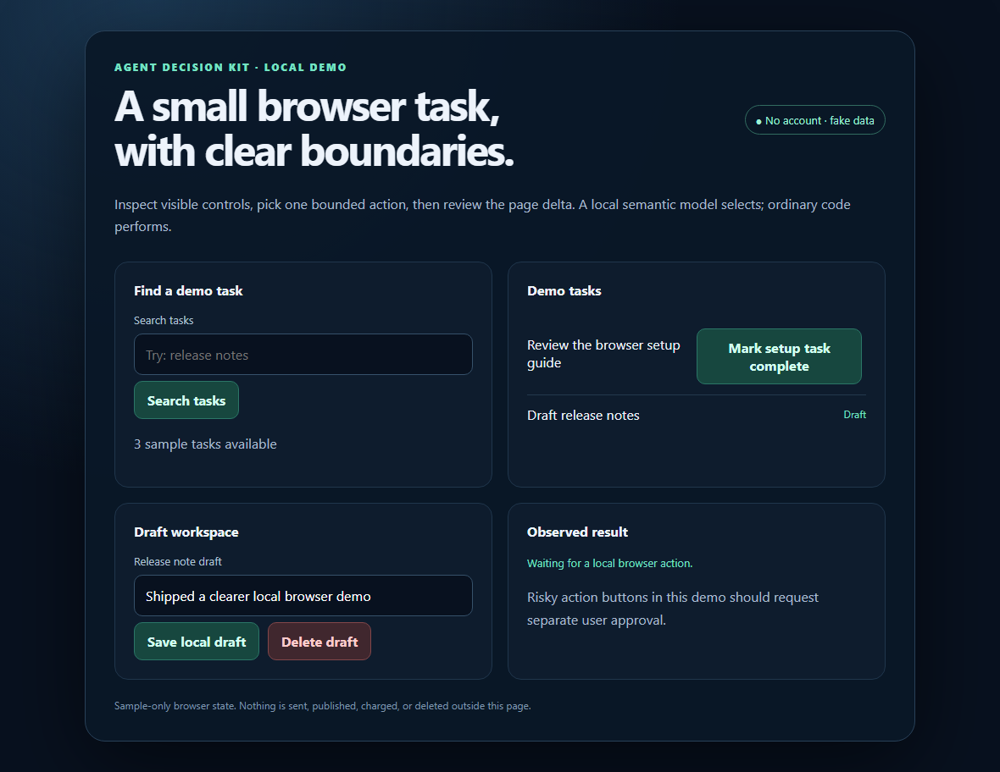
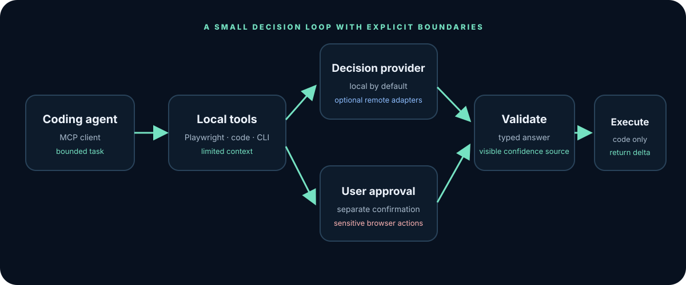
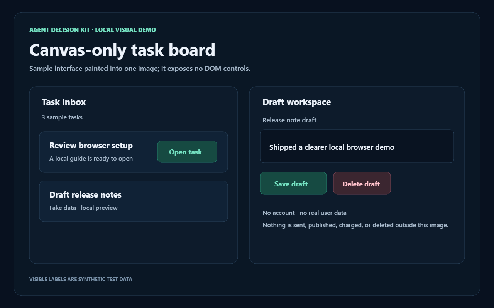

<div align="center">


# Agent Decision Kit

**Fast, local-first decisions and browser actions for coding agents.**

[](https://github.com/krmdl/agent-decision-kit/actions/workflows/ci.yml)
[](LICENSE)
[](https://nodejs.org/)

[Quick start](#quick-start) · [Browser demo](#browser-demo) · [Agent setup](#connect-your-agent) · [Privacy and cost](#privacy-and-cost)

</div>



Agent Decision Kit is an experimental Apache-2.0 MCP server and CLI for the small decisions inside agent loops: which visible browser action to take, which file to inspect, what context to keep, whether a diff deserves review, and whether supplied evidence supports a completion claim.

It uses ordinary code to constrain choices and execute actions. Its default decision backend is a small model that runs locally through Transformers.js. Optional Jev and OpenAI-compatible providers are adapters, not requirements.

## What it does

- **Browser loop first.** Playwright inspects a bounded set of visible controls, chooses from those controls, and returns a short page delta. Launch an isolated profile or attach to a selected local Chrome tab over CDP.
- **Approval for consequential actions.** Payment, sending, publishing, deletion, and form submission candidates pause for a distinct confirmation call. Password and file inputs are excluded. Text fields can be filled without submitting them.
- **Structured decisions.** Batch up to eight `Choice`, `Score`, and yes/no (`noul`) questions in one request, with probability estimates and an explicit calibration label.
- **Fast local browser paths.** Unique quoted labels, numbered tabs, named checkboxes, and clear expand-then-submit steps can resolve without model inference. These rule-based choices return no probability and keep sensitive actions behind the approval gate.
- **Coding workflows.** Find relevant files, prune context while keeping requested strings verbatim, suggest a model route, pre-screen a diff, rerank, classify, screen, extract from caller-supplied candidates, and check completion evidence.
- **CLI and MCP.** Use the same functions in a shell pipeline or from an MCP-compatible coding agent.
- **Local vision fallback.** When a page has no visible DOM actions, `browser_decide_and_act` returns immediately and points to `browser_visual_inspect`; that separate tool can answer a question about the screenshot with [SmolVLM2 500M](https://huggingface.co/HuggingFaceTB/SmolVLM2-500M-Video-Instruct), an Apache-2.0 vision-language model. First use downloads model files; CPU inference can take tens of seconds. The screenshot stays local. Its description is uncalibrated and never triggers an action.



### Calibration is visible

`confidence` and probability values are estimates, not a promise that the selected action is correct. Every answer says where calibration comes from: `uncalibrated-estimate`, `posthoc-calibrated`, `provider-calibrated`, or `unavailable`. The default MiniLM embedding baseline is **uncalibrated** and is not a drop-in Jev replacement. No speed, accuracy, or parity claim is made before an independent evaluation.

## Quick start

Requirements: Node.js 20.19 or newer. The repository is in experimental alpha; the npm package is not published yet. Run from a local checkout:

```sh
npm install
npm run build
npm run browser:install
npm run mcp
```

Configure your agent to start `node /absolute/path/to/agent-decision-kit/dist/cli.js mcp`. Agent-specific files and examples are in [`docs/agents/`](docs/agents/). When the package is published, the shorter command will be `npx -y agent-decision-kit mcp`.

For a one-shot CLI decision, pass JSON on stdin:

```sh
cat examples/decision.json | node dist/cli.js decide
```

For local semantic filtering of newline-delimited items:

```sh
cat examples/tasks.txt | node dist/cli.js filter --query "is a browser automation task"
```

The first decision call downloads the configured embedding model unless its files are already cached. It runs locally after that. To use a local Ollama or another OpenAI-compatible server instead, set `AGENT_DECISION_PROVIDER=openai-compatible`; the default endpoint is `http://127.0.0.1:11434/v1`.

## Browser demo

The demo is a local static page with fictional tasks. Start any static server from the repository root, then launch the MCP server and ask your agent:

> Open the local browser demo, inspect the visible tasks, and mark the setup task complete. Show me the page change.

The accessible demo is [`examples/browser-demo.html`](examples/browser-demo.html). The screenshot above and short recording at [`website/public/images/browser-demo.gif`](website/public/images/browser-demo.gif) were captured with Playwright. The second example draws its interface into a canvas so there are no DOM controls for Playwright to inspect; it is designed to exercise the optional vision path:

[Open the canvas-only demo](website/public/demos/visual-only-demo.html) · [`npm run vision:verify`](package.json) runs a local model smoke check (first use downloads model weights).



Both demos use synthetic data. They do not send, publish, charge, or delete anything outside the page.

The browser tool does not bypass CAPTCHAs, site access controls, or authentication. For remote model providers, browser labels are blocked by default; set `AGENT_ALLOW_REMOTE_BROWSER_CONTEXT=true` only when you intend to share bounded page labels with that provider.

## Connect your agent

| Agent | Setup guide | MCP configuration format |
| --- | --- | --- |
| Claude Code | [Guide](docs/agents/claude-code.md) | CLI or `.mcp.json` |
| Codex CLI | [Guide](docs/agents/codex-cli.md) | `~/.codex/config.toml` |
| Cursor | [Guide](docs/agents/cursor.md) | `.cursor/mcp.json` |
| Gemini CLI | [Guide](docs/agents/gemini-cli.md) | `settings.json` or `gemini mcp add` |
| Windsurf Cascade | [Guide](docs/agents/windsurf.md) | `mcp_config.json` |
| VS Code / Copilot Chat | [Guide](docs/agents/vscode.md) | `.vscode/mcp.json` |
| GitHub Copilot CLI | [Guide](docs/agents/copilot-cli.md) | `~/.copilot/mcp-config.json` |
| Cline | [Guide](docs/agents/cline.md) | `~/.cline/mcp.json` or IDE settings |
| OpenCode | [Guide](docs/agents/opencode.md) | `opencode.json` |

All integrations use the standard MCP stdio transport. The generic MCP handshake and tool schemas are covered by project tests. We have not claimed that every agent version was installed and end-to-end tested in this checkout.

Claude Code users can also opt into the [prompt-routing hook](integrations/claude-code-hooks/README.md). It adds a local, unbenchmarked route suggestion to submitted prompts; it never changes the active model.

## Privacy and cost

- No account, hosted inference endpoint, product telemetry, or central server is required.
- The default provider sends state to the local Transformers.js model after its weights are downloaded. The optional local OpenAI-compatible adapter also defaults to loopback.
- Remote OpenAI-compatible and Jev providers send the decision request to the configured provider. Browser context is separately blocked for remote providers unless explicitly opted in.
- Jev is optional and can incur TypeSafe charges. Its API endpoint and request format follow [TypeSafe's API docs](https://api.typesafe.ai/docs). Jev outputs are not stored as training data, used to tune the local model, or used to build an imitator; review the [TypeSafe agreement](https://typesafe.ai/legal/mca) before enabling that adapter.
- Chromium uses a separate persistent profile at `~/.agent-decision-kit/browser-profile`. Attaching through CDP does not read cookies into tool output. Closing an attached session disconnects instead of closing the selected Chrome context.

## Benchmarks and honest claims

`benchmarks/` contains labeled fixtures, an evaluation protocol, and metric definitions. Report decision accuracy, calibration, browser task success, action count, and latency separately. There are **no performance results in this release**. BrowserGym adapters and cross-agent runtime checks remain evaluation work; CI does not generate fabricated benchmark charts.

We do not claim the 500 ms p95 target, 7-second browsing demo, Jev equivalence, or any other speedup until a reproducible run is published with hardware, versions, sample counts, and raw results.

## Development

```sh
npm install
npm run typecheck
npm test
npm run build
npm run hook:verify
npm run agents:verify
npm --prefix website install
npm run website:build
```

See [contributing](CONTRIBUTING.md), [security policy](SECURITY.md), and [the changelog](CHANGELOG.md). The source is released under [Apache-2.0](LICENSE).
