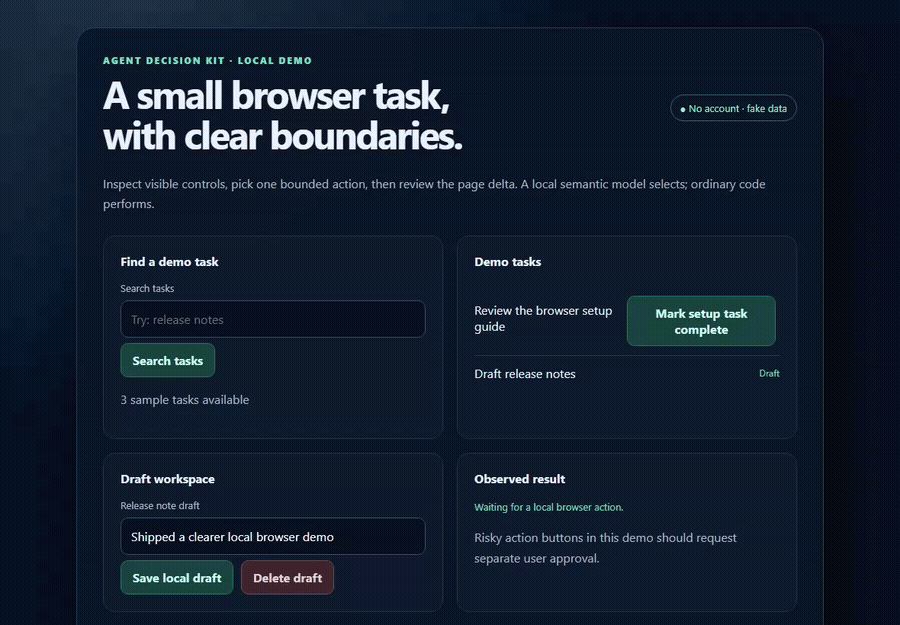
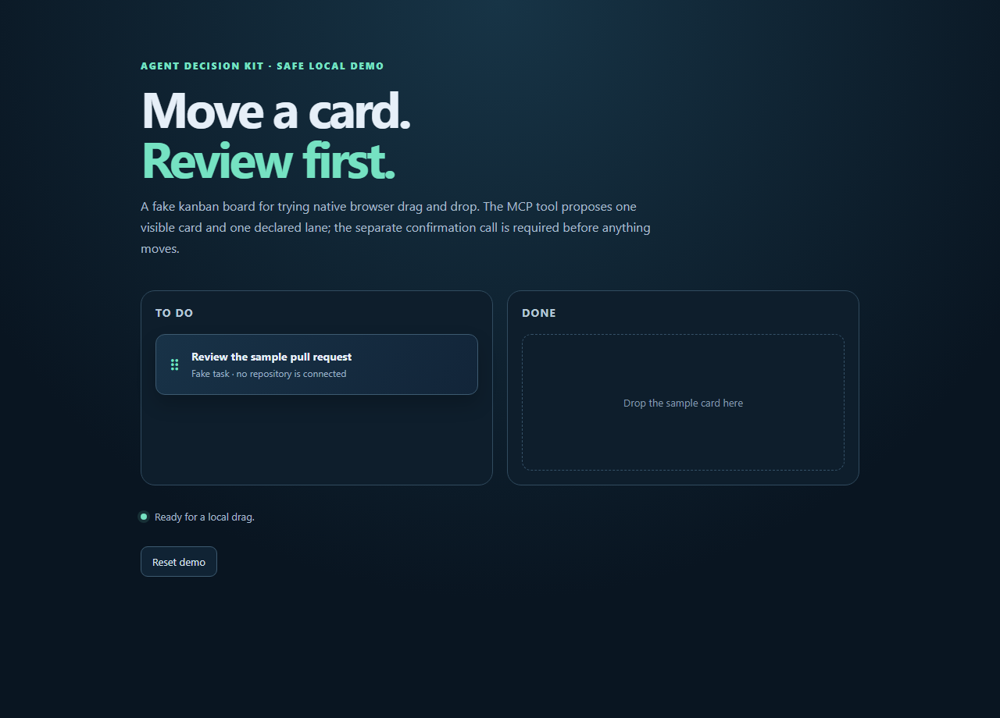

<div align="center">


# Agent Decision Kit

**Fast, local-first decisions and browser actions for coding agents.**

[](https://github.com/krmdl/agent-decision-kit/actions/workflows/ci.yml)
[](LICENSE)
[](https://nodejs.org/)

[Quick start](#quick-start) · [Browser demo](#browser-demo) · [Agent setup](#connect-your-agent) · [Privacy and cost](#privacy-and-cost)

</div>


<p align="center">
  <strong>Watch the bounded browser workflow</strong><br>
  
</p>

Agent Decision Kit is an experimental Apache-2.0 MCP server and CLI for the small decisions inside agent loops: which visible browser action to take, which file to inspect, what context to keep, whether a diff deserves review, and whether supplied evidence supports a completion claim.

It uses ordinary code to constrain choices and execute actions. Its default decision backend is a small model that runs locally through Transformers.js. Optional Jev and OpenAI-compatible providers are adapters, not requirements.

## What it does

- **Browser loop first.** Playwright inspects up to 80 visible controls, including text and icon targets whose only interaction hint is a CSS pointer cursor, native draggable items, and declared drop targets. Distinct labeled child targets are exposed separately; CSS image filenames can label icon-only controls. Custom targets always require confirmation, and every drag must be approved in a separate call. Launch an isolated profile or [list and explicitly select a local Chrome tab](docs/browser-chrome.md) over loopback CDP. Read-only date widgets are marked in the snapshot and opened through a separate click before choosing a visible date; they are never passed to `browser_fill`.
- **Precise form controls.** `browser_inspect` exposes up to three bounded visible HTML tables (six rows and cells per table), adds the visible non-action cells to table-action labels so repeated actions can be distinguished by row, and returns explicit adjacent labels for otherwise unassociated form fields, enabled native-select labels, and slider bounds without returning current form values. Exact requested select options and slider values are applied before a later submit proposal; ARIA and supported jQuery UI sliders are moved with keyboard input. `browser_set_range` never submits the form. A task that asks for text entry and submission is stopped while the named visible fields remain empty. `browser_copy_field` copies locally from one visible text input or textarea to another without returning the text to the agent. `browser_set_checkboxes` updates up to 40 uniquely labeled native checkboxes in one call and keeps submission separate.
- **Approval for consequential actions.** Payment, sending, publishing, deletion, form submission, native drag-and-drop moves, and non-semantic CSS pointer targets pause for a distinct confirmation call. Dragging only accepts an inspected native source and declared target; stale page state cancels the proposal. Password and file inputs are excluded. Text and date/time fields can be filled or copied locally, and native select options can be chosen, without clicking submit. Contenteditable drafts and textarea values are masked from DOM text; private field values and action destinations are hashed locally to invalidate stale approvals, never returned to the agent.
- **Structured decisions.** Batch up to eight `Choice`, `Score`, and yes/no (`noul`) questions in one request, with probability estimates, confidence source, and explicit calibration label.
- **Warm before a latency-sensitive run.** Call `provider_warmup` once inside the same MCP session to initialize the local model before ambiguous decisions. Its first call may download weights; it is optional and does not promise a speed target.
- **Fast local browser paths.** A unique exact control label in a simple click/tap/open request (quoted or unquoted), a unique visible destination named in a navigation request, a unique low-risk view action in a table row matching the task's named record, role-prefixed labels, visible menu-item labels, ordinal radio/textbox instructions, explicit textarea clicks, numbered tabs, named checkboxes, and searches through multiple disclosures can resolve without model inference. A `page-changed-during-decision` response performs no action; inspect the refreshed page and request a new decision. If an action completes but its follow-up page snapshot times out, the tool returns `inspectionPending: true`, invalidates old refs, and marks the resulting page state unverified so the agent can wait and inspect again. For requests to view all/every item in a collection, an exact visible page heading marks the destination and stops further navigation. Duplicate labels remain ambiguous; automatic actions stop when the same task cycles back to an earlier inspected page state. These rule-based choices return no probability; custom targets and sensitive actions still wait for approval.
- **Coding workflows.** Find relevant files, prune context while keeping requested strings verbatim, optionally rerank bounded source chunks against the current task with the configured provider, suggest a model route, pre-screen a diff, rerank, classify, screen, extract from caller-supplied candidates, and check completion evidence. Context selection stays local by default; semantic ranking is an explicit opt-in.
- **CLI and MCP.** Use the same functions in a shell pipeline or from an MCP-compatible coding agent.
- **Fast visual fallback.** When a page has no semantic controls or clear CSS pointer targets, `browser_decide_and_act` returns immediately and points to `browser_visual_text`. It runs local Tesseract OCR, masks editable fields, and returns bounded lines and screenshot-pixel boxes. Use `contentMode: "digits"` only for an explicitly numeric task; it restricts recognition to 0–9, returns per-character boxes, retries suspiciously merged characters on small local crops, and re-reads up to eight repeated digit glyphs with single-character OCR. `browser_visual_action` proposes a click only for one exact, unique OCR match; `browser_visual_click` and `browser_visual_drag` let the caller propose a point interaction when pixels have no text target. These actions always require separate approval and are rejected if the masked screenshot changes. `browser_visual_scroll` moves a visual viewport and returns fresh OCR context. OCR can miss or misread text; screenshots stay local while recognized text enters the agent context.
- **Optional visual question answering.** `browser_visual_inspect` uses [SmolVLM2 500M](https://huggingface.co/HuggingFaceTB/SmolVLM2-500M-Video-Instruct), an Apache-2.0 vision-language model, to answer a bounded screenshot question. It masks editable fields, reports screenshot and viewport dimensions, and can estimate a visible target's location when asked. First use downloads model files; CPU inference can take tens of seconds. The caller still has to choose a point and request an approved click or drag; the model does not act, and its descriptions and coordinate estimates are uncalibrated.


### Calibration is visible

`confidence` and probability values are estimates, not a promise that the selected action is correct. Each model answer identifies `confidenceSource` as `provider-reported`, `maximum-probability`, or `unavailable`, separately from its calibration label (`uncalibrated-estimate`, `posthoc-calibrated`, `provider-calibrated`, or `unavailable`). Deterministic browser matches report `not-applicable-rule` and do not invent probabilities. The default MiniLM embedding baseline is **uncalibrated** and is not a drop-in Jev replacement. No speed, accuracy, or parity claim is made before an independent evaluation.

For Jev, `provider-calibrated` records TypeSafe's calibration claim; Agent Decision Kit has not independently measured Jev's calibration. The adapter checks the required Choice and Score confidence and probability fields against the [public API schema](https://api.typesafe.ai/openapi.json), including exact coverage of the requested options. It rejects malformed distributions rather than filling missing options with zero.

## Quick start

Requirements: Node.js 20.19 or newer. The repository is in experimental alpha; the npm package is not published yet. Run from a local checkout:

```sh
npm install
npm run build
npm run browser:install
npm run mcp
```

Configure your agent to start `node /absolute/path/to/agent-decision-kit/dist/cli.js mcp`. Run `node dist/cli.js config claude-code` (or another supported alias) to print a ready-to-copy config for this built checkout. Agent-specific files and examples are in [`docs/agents/`](docs/agents/). When the package is published, the shorter command will be `npx -y agent-decision-kit mcp`.

For a one-shot CLI decision, pass JSON on stdin:

```sh
cat examples/decision.json | node dist/cli.js decide
```

For local semantic filtering of newline-delimited items:

```sh
cat examples/tasks.txt | node dist/cli.js filter --query "is a browser automation task"
```

The first decision call downloads the configured embedding model unless its files are already cached. The local provider defaults to CPU for predictable behavior. To request an accelerator, set `AGENT_DECISION_DEVICE=auto` or choose a device supported by the installed Transformers.js runtime, such as `dml` on Windows, `cuda` on Linux x64, or `coreml` on macOS; set it to `cpu` to force CPU inference. Device availability depends on the runtime build and drivers, and acceleration can be slower for small batches. Benchmark the same workload on the target machine before changing the default. The upstream [ONNX Runtime Node.js support matrix](https://onnxruntime.ai/docs/get-started/with-javascript/node.html) lists platform-specific execution providers. To use a local Ollama or another OpenAI-compatible server instead, set `AGENT_DECISION_PROVIDER=openai-compatible`; the default endpoint is `http://127.0.0.1:11434/v1`.

For task-aware context selection, pipe tool output through `context-prune --semantic --query "..."`. It reranks at most 32 bounded source snippets with the configured provider; exact retained strings and every selected source chunk are copied unchanged. The default command remains a local heuristic. If the configured provider is remote, semantic pruning sends those bounded snippets to that provider.

## Browser demo

The demo is a local static page with fictional tasks. Start any static server from the repository root, then launch the MCP server and ask your agent:

> Open the local browser demo, inspect the visible tasks, and mark the setup task complete. Show me the page change.

The accessible demo is [`examples/browser-demo.html`](examples/browser-demo.html). The screenshot above and short recording at [`website/public/images/browser-demo.gif`](website/public/images/browser-demo.gif) were captured with Playwright. The second example draws its interface into a canvas, so Playwright has no DOM controls to inspect. It demonstrates fast local OCR and an exact-text click proposal that requires separate approval:

[Open the canvas-only demo](website/public/demos/visual-only-demo.html) · [`npm run ocr:verify`](package.json) checks OCR, cancellation, approval, and stale-screenshot rejection · [`npm run vision:verify`](package.json) runs local visual question answering (first use downloads model weights).


Both demos use synthetic data. They do not send, publish, charge, or delete anything outside the page.

### Approval-gated drag and drop

[`examples/browser-drag-demo.html`](examples/browser-drag-demo.html) is a local-only kanban board for trying native drag and drop. `browser_inspect` lists the draggable card and declared lanes; call `browser_drag` with their fresh refs, review the proposed move, then call `browser_confirm` separately. The page does not connect to a repository or service.



This workflow only supports DOM-backed native draggable sources and declared targets. It does not infer free-form mouse gestures, calendar time-range drags, or file uploads. The approval gate does not prove that the page application accepted the move, so inspect the resulting page.

The browser tool does not bypass CAPTCHAs, site access controls, or authentication. For remote model providers, browser labels are blocked by default; set `AGENT_ALLOW_REMOTE_BROWSER_CONTEXT=true` only when you intend to share bounded page labels with that provider.

## Connect your agent

| Agent | Setup guide | MCP configuration format |
| --- | --- | --- |
| Claude Code | [Guide](docs/agents/claude-code.md) | CLI or `.mcp.json` |
| Codex CLI | [Guide](docs/agents/codex-cli.md) | `~/.codex/config.toml` |
| Cursor | [Guide](docs/agents/cursor.md) | `.cursor/mcp.json` |
| Gemini CLI | [Guide](docs/agents/gemini-cli.md) | `settings.json` or `gemini mcp add` |
| Windsurf Cascade | [Guide](docs/agents/windsurf.md) | `mcp_config.json` |
| VS Code / Copilot Chat | [Guide](docs/agents/vscode.md) | `.vscode/mcp.json` |
| GitHub Copilot CLI | [Guide](docs/agents/copilot-cli.md) | `~/.copilot/mcp-config.json` |
| Cline | [Guide](docs/agents/cline.md) | CLI MCP wizard or IDE settings |
| OpenCode | [Guide](docs/agents/opencode.md) | `opencode.json` |

All integrations use the standard MCP stdio transport. CI parses each guide and the generated command for every alias, starts all nine generated server commands, and calls `model_route` through MCP; separate protocol tests cover the in-memory transport. This validates the project's side of each config, not each vendor's parser or UI. In local Windows checks, Claude Code 2.1.218 reported the isolated server as connected and Codex CLI 0.154.0 loaded an isolated entry as enabled, but no model-backed agent turn was run. Additional isolated client checks and their limits are listed in the [agent compatibility table](docs/agents/README.md); Copilot Chat, Windsurf Cascade, and Cline have not been installed here.

Claude Code users can also opt into the [prompt-routing hook](integrations/claude-code-hooks/README.md). It adds a local, unbenchmarked route suggestion to submitted prompts; it never changes the active model.

## Privacy and cost

- No account, hosted inference endpoint, product telemetry, or central server is required.
- The default provider sends state to the local Transformers.js model after its weights are downloaded. The optional local OpenAI-compatible adapter also defaults to loopback.
- Remote OpenAI-compatible and Jev providers send the decision request to the configured provider. Browser context is separately blocked for remote providers unless explicitly opted in.
- Semantic context pruning is disabled by default. When explicitly enabled, it sends up to 32 snippets (at most 1,200 characters each) and the supplied query to the configured decision provider; keep a local provider selected for local-only processing.
- Jev is optional and can incur TypeSafe charges. Its API endpoint and request format follow [TypeSafe's API docs](https://api.typesafe.ai/docs). Jev outputs are not stored as training data, used to tune the local model, or used to build an imitator; review the [TypeSafe agreement](https://typesafe.ai/legal/mca) before enabling that adapter.
- Chromium uses a separate persistent profile at `~/.agent-decision-kit/browser-profile`; set `AGENT_DECISION_BROWSER_DIR` to change it. CDP attachment uses a dedicated Chrome profile and explicit tab selection. Cookies, storage, URL credentials/query/hash, local file paths, and editable form values are not returned by DOM tools. A non-reversible digest of form state and action destinations is kept locally only to expire stale approvals; raw field values are not returned. Local OCR masks editable fields and returns bounded visible page text to the calling agent; that text may enter its model context. Treat it as untrusted page content. The screenshot itself stays local. Remote decision-provider browser context still requires explicit opt-in. Closing an attached session disconnects instead of closing the selected Chrome context.

## Benchmarks and honest claims

`benchmarks/` contains labeled fixtures, an evaluation protocol, raw records, and metric definitions. The latest full curated MiniWoB integration run completed 25/26 tasks with no harness timeouts on Windows CPU. It includes a repaired read-only calendar-date path and an OCR-only visual task that passed after five synthetic local approvals. The remaining `daily-calendar` task took 28.928 s for a local visual description, took no browser action, and received zero reward. Across 26 episodes, end-to-end latency including reset was p50 1.618 s / p95 2.854 s; the browser tool loop was p50 339 ms / p95 1,169 ms; three timed local semantic calls had p50 173 ms / p95 185 ms. These bounded integration results are not autonomous-agent scores or general quality/speed claims. A separate DOM-focused MiniWoB run completed all 24 selected tasks and excluded the two visual-only pages; `read-table-2` completed through bounded visible table rows and explicit adjacent field labels, and `click-checkboxes-large` selected ten named checkboxes in one batch call. Its end-to-end p50/p95 was 1.665/2.598 s, browser loop 323/907 ms, and four local semantic calls 191/430 ms. The harness reads only explicit synthetic task instructions and bounded visible table rows, and separately approves local submissions, so this is not a full MiniWoB score or autonomous-agent result. A separate five-seed visual-only `ascending-numbers` OCR smoke now completed 5/5 after repeated digit glyphs received bounded single-character retries; the earlier 4/5 baseline is retained. This one visual task does not establish general OCR reliability or speed. The previous full 26-task run at commit `8ffc709` completed 23/26 and left `ascending-numbers`, `daily-calendar`, and `read-table-2` incomplete; the separate DOM-only run completes `read-table-2`, but its task set is smaller and its Windows host differs from that earlier Linux run. A 30-case project-specific decision fixture scored 7/10 on Choice, 5/10 on yes/no, and 1.04 mean absolute error on Score; its labels are not held out and its probability estimates remain uncalibrated. A repeat of the same 18 read-only WebArena Verified navigation tasks on synthetic Magento admin data returned 3 full rewards, 13 partial rewards, 2 zero rewards, and no timeouts (mean reward 0.528). End-to-end latency including BrowserGym reset was p50 13.257 s / p95 18.610 s; 61 decision/action calls had p50 652 ms / p95 1.176 s, including browser inspection and local selection rather than pure model inference. The repeated run uses compact decision context and a bounded page-settle wait after stale snapshots; one pair of runs does not establish a general speedup. This is a narrow single-site integration sample, not a WebArena score or Jev comparison. A focused working-tree follow-up on tasks 711 and 713 now visits Product Views and Bestsellers, fills both requested date ranges, and clicks Show Report in five actions. Both filtered routes still receive 0.5 reward; the reason for the remaining partial score is unresolved. See the [task 711 date-filter trace](benchmarks/results/webarena-verified-docker-b-report-date-filter-fix-task-711-20261002.json) and [task 713 date-filter trace](benchmarks/results/webarena-verified-docker-b-report-date-filter-fix-task-713-20261002.json). See the [benchmark report](https://krmdl.github.io/agent-decision-kit/benchmarks/), the [latest MiniWoB 26-task aggregate with 26 raw episodes](benchmarks/results/miniwob-full-26-post-timeout-fix-20261002.json), the [DOM-focused MiniWoB aggregate with 24 raw episodes](benchmarks/results/miniwob-dom-table-24-5b52abc-utf8.json), the [visual OCR retry aggregate with five raw episodes](benchmarks/results/miniwob-visual-digits-single-char-retry-5-seed-smoke.json), the [latest page-settle WebArena Verified repeat and raw episodes](benchmarks/results/webarena-verified-docker-b-page-settle-18-20261002-summary.json), the [previous localhost-origin WebArena Verified run](benchmarks/results/webarena-verified-docker-b-localhost-18-20261002-summary.json), the [initial WebArena baseline](benchmarks/results/webarena-verified-shopping-admin-initial-18-task-baseline.json), and the [reproduction protocol](benchmarks/README.md). The original multi-site WebArena and VisualWebArena suites and Jev parity remain evaluation work. A separate BrowserGym Verified task 157 rerun on the current working tree reached full reward 1.0 in two navigation actions; its action calls took 317 ms and 818 ms, and its 14.066-second end-to-end time includes an 11.236-second environment reset. This single task does not change the 18-task aggregate or establish general performance. A cross-backend BrowserGym Lite task 157 smoke reached the official evaluator but returned 0.0 on the synthetic Verified backend after the final URL stayed on the dashboard; it is not a canonical Lite result. See both [raw episodes](benchmarks/results/webarena-verified-docker-b-157-post-inspection-followup-20261002.json) and the [latest cross-backend trace](benchmarks/results/webarena-lite-compat-shopping-admin-post-timeout-fix-20261002.json) plus its [earlier trace](benchmarks/results/webarena-lite-compat-shopping-admin-inspection-pending-20261002.json). CI does not generate fabricated benchmark charts.

Five repeated 30-case provider runs on one Windows 10 Ryzen 5 5600H / GTX 1650 laptop measured nearest-rank p95 across all 150 calls at 21 ms on CPU and 148 ms with DirectML requested; the slowest DirectML-requested first call, including initialization, took 693 ms. The cache directory existed before the runs, but individual model files were not checked; a separate ONNX profile confirmed DirectML node execution with CPU fallback. These are decision-call measurements on the same small, non-held-out fixture, not full browser-loop latency. This sample's aggregate p95 was below 500 ms, while one cold call exceeded it; the broader consumer-GPU target, 7-second browsing demo, Jev equivalence, and any general speedup remain unverified. The CPU microbenchmark below is synthetic and excludes browser inspection and actions.

A separate local CPU microbenchmark selected the exact link from 57 short candidates in one synthetic browser-style question. The first provider call was 317 ms; nine warm repeats were p50 135 ms / p95 146 ms. It excludes browser inspection and actions, repeats one question rather than nine independent tasks, and does not measure a full browser loop. See the [fixture](benchmarks/fixtures/browser-choice-latency-57.jsonl) and [raw report](benchmarks/results/browser-choice-latency-57-cpu-20261002.json); its low confidence is uncalibrated.

## Development

```sh
npm install
npm run typecheck
npm test
npm run package:verify
npm run mcp:verify
npm run hook:verify
npm run agents:verify
npm --prefix website install
npm run website:build
```

See [contributing](CONTRIBUTING.md), [security policy](SECURITY.md), and [the changelog](CHANGELOG.md). The source is released under [Apache-2.0](LICENSE).
